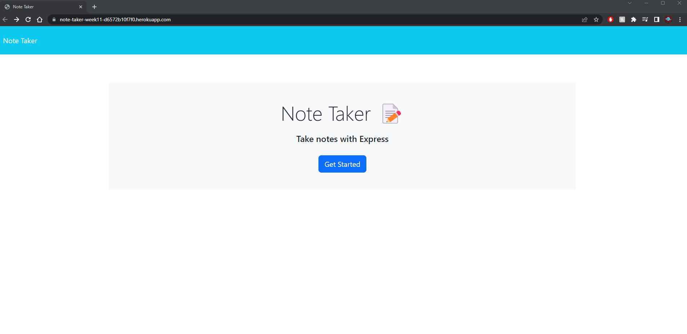
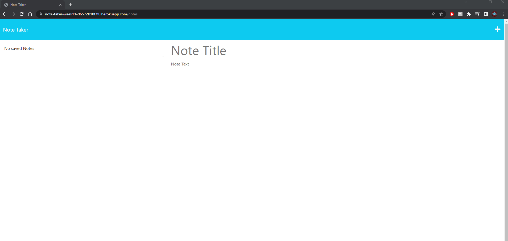
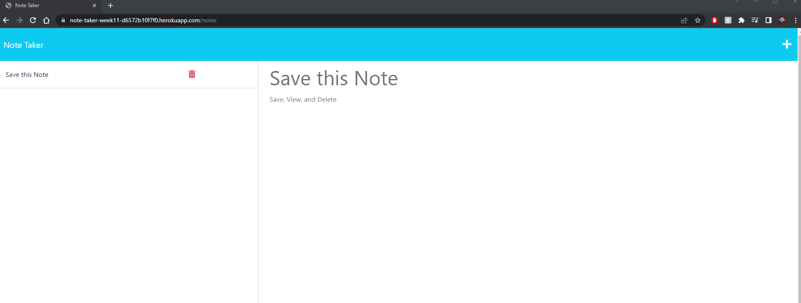

# Note Taker App
The Note Taker App is a simple web application that allows users to create, view, and delete notes. It provides a user-friendly interface for managing personal notes and keeping track of important information.

## User Story
- AS A small business owner
- I WANT to be able to write and save notes
- SO THAT I can organize my thoughts and keep track of tasks I need to complete

## Acceptance Criteria
- GIVEN a note-taking application
- WHEN I open the Note Taker
- THEN I am presented with a landing page with a link to a notes page
- WHEN I click on the link to the notes page
- THEN I am presented with a page with existing notes listed in the left-hand column, plus empty fields to enter a new note title and the note’s text in the right-hand column
- WHEN I enter a new note title and the note’s text
- THEN a Save icon appears in the navigation at the top of the page
- WHEN I click on the Save icon
- THEN the new note I have entered is saved and appears in the left-hand column with the other existing notes
- WHEN I click on an existing note in the list in the left-hand column
- THEN that note appears in the right-hand column
- WHEN I click on the Write icon in the navigation at the top of the page
- THEN I am presented with empty fields to enter a new note title and the note’s text in the right-hand column

## Getting Started
To use the Note Taker App locally, follow these steps:
1. Clone the repository to your local machine.
2. Install the required dependencies by running npm install in the project directory.
3. Start the server by running npm start.
4. Open your web browser and navigate to http://localhost:3000.
5. Follow the on-screen instructions to create, view, and delete notes.
OR you can visit the deployed application at: https://note-taker-week11-d6572b10f7f0.herokuapp.com/

## Images of Deployed Applicaiton

Home Page

Before you make a note

After you make and save a note

## Technologies Used
The Note Taker App is built using the following technologies:

- Express.js: A minimal and flexible web application framework for Node.js.
- HTML: The standard markup language for creating web pages.
- CSS: The style sheet language used for styling the web pages.
- JavaScript: The programming language used for client-side functionality.
- Bootstrap: A popular CSS framework for building responsive and mobile-first websites.

## Project Links
Deployed App: https://note-taker-week11-d6572b10f7f0.herokuapp.com/
GitHub Repo: https://github.com/KGBerry542/Note-Taker

## License
This project is licensed under the MIT License - see the LICENSE file for details.